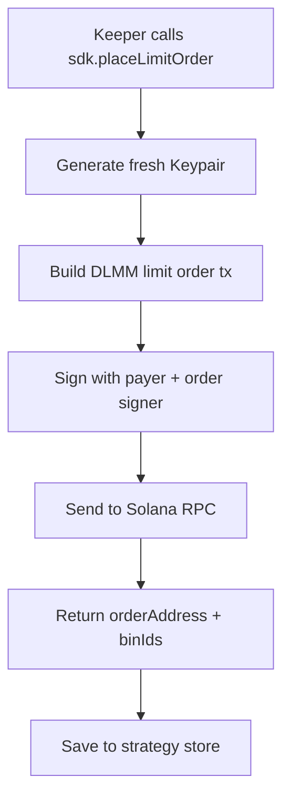
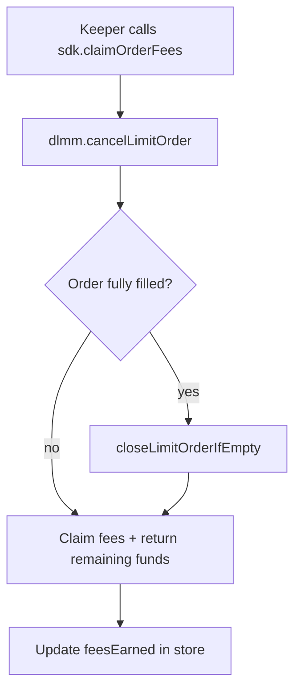
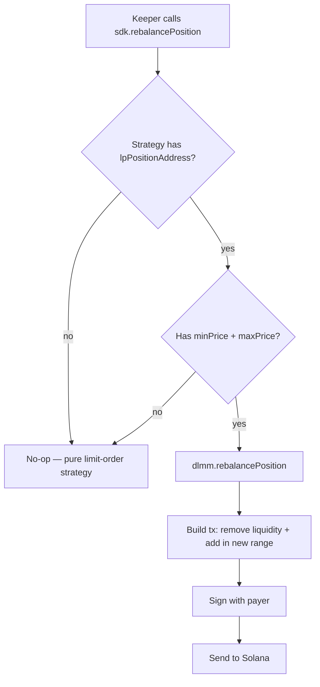

# OrderFlow — How It Actually Works

> **Self-executing DCA, take-profit and auto-rebalancing terminal powered by Meteora DLMM limit orders.**

---

## 1. High-Level Concept

OrderFlow is a **"set it and forget it" DCA / take-profit terminal** built on Meteora DLMM. The key insight is:

> **A DLMM limit order is productive liquidity.** While waiting for your price, it earns LP fees.

No matching engine, no off-chain bot — just swap flow filling your bins, and you get paid while you wait. OrderFlow wraps that engine behind a "set it and forget it" UX.

### 1.1 The DCA-with-Yield Loop

1. The **wizard** turns "amount + tranches + timeframe" into a set of price brackets.
2. The **keeper** spreads those brackets across DLMM bins and places each tranche via `@meteora-ag/dlmm` `createLimitOrder` — a real on-chain order.
3. While price never reaches a bin, the order **still earns the LP fee share** on swap flow that touches it (DLMM credits 50% of the limit-order fee portion to order participants).
4. The **keeper loop** claims those fees (above a threshold) and re-pins any LP positions that drifted out of range.

---

## 2. System Architecture

```
┌─────────────────────────────────────────────────────────────────┐
│  apps/web  (Vite + React)                                       │
│  • Wizard: amount → token → tranches → review → launch          │
│  • Dashboard: live orderbook + strategy list                     │
└───────────────────────────┬─────────────────────────────────────┘
                            │ HTTP (read + create strategy)
┌───────────────────────────▼─────────────────────────────────────┐
│  packages/api  (Express)                                         │
│  • Proxies Meteora Data API for pools, book, portfolio, orders   │
│  • Persists strategies to JSON store                             │
└───────────────────────────┬─────────────────────────────────────┘
                            │ reads store / executes
┌───────────────────────────▼─────────────────────────────────────┐
│  packages/keeper  (long-running cron)                            │
│  • Reads strategies from JSON store                              │
│  • Places DLMM limit orders via SDK                              │
│  • Claims fees / re-pins positions                               │
│  • Signs with KEEPER_PRIVATE_KEY                                 │
└───────────────────────────┬─────────────────────────────────────┘
                            │ on-chain CPI / txs
┌───────────────────────────▼─────────────────────────────────────┐
│  Meteora DLMM (lb_clmm) + Zap + DBC — Solana mainnet             │
└─────────────────────────────────────────────────────────────────┘
```

### 2.1 Component Responsibilities

| Component | Technology | Responsibility |
|---|---|---|
| **apps/web** | Vite + React | "Set it & forget it" wizard (amount→token→tranches→go); live orderbook-style dashboard (`/dashboard`) |
| **packages/api** | Express | Read layer: `/api/pools`, `/api/book/:pool`, `/api/limit-orders/:w`, `/api/portfolio/:w`, `/api/positions/:pool/:w`; proxies Meteora's official Data API |
| **packages/keeper** | Node.js cron | Advance scheduled tranches → place DLMM limit orders; re-pin LP positions; claim fees |
| **packages/sdk** | TypeScript | `OrderFlowSdk` — wraps `@meteora-ag/dlmm` + `@meteora-ag/zap-sdk` |
| **packages/core** | TypeScript (dep-free) | Shared types, constants, config, DLMM bin math |
| **packages/anchor** | Anchor (optional) | On-chain `DcaStrategy` ledger (skeleton + tests) |

---

## 3. What Happens When a Strategy Is Created

### 3.1 Step-by-Step Flow

| Step | Component | Action |
|---|---|---|
| 1 | **Web Wizard** | User fills: amount, side (bid/ask), pool, tranches, interval, min/max price |
| 2 | **Web Wizard** | Frontend calls `POST /api/strategies` with `owner = wallet address` |
| 3 | **API** | Validates, creates `DcaStrategy` object with `status: 'scheduled'`, saves to `data/strategies.json` |
| 4 | **Web** | Shows "Strategy launched — Keeper is placing tranche 1" |
| 5 | **Keeper** | On next tick (every 30s), picks up the strategy from the store |
| 6 | **Keeper** | Calculates how many tranches are due based on wall-clock time |
| 7 | **SDK** | For each due tranche, calls `dlmm.placeLimitOrder()` with a fresh signer keypair |
| 8 | **Solana** | Transaction is signed by the **keeper's keypair** and sent to mainnet |
| 9 | **Keeper** | Saves the `orderAddress` + `binIds` back to the strategy in the JSON store |
| 10 | **Keeper** | On subsequent ticks: claims fees for placed orders, places more tranches if due |
| 11 | **Dashboard** | Polls `/api/strategies/:wallet` and Meteora Data API to show live status |

### 3.2 The Launch Sequence in Detail

```mermaid
flowchart TD
    A[User clicks "Launch strategy"] --> B[Frontend: POST /api/strategies]
    B --> C[API: Validate owner + pool]
    C --> D[API: Create DcaStrategy with status=scheduled]
    D --> E[API: Save to data/strategies.json]
    E --> F[Frontend: Show "Strategy launched" success]
    F --> G[Keeper: Next tick (≤30s)]
    G --> H[Keeper: Load strategy from store]
    H --> I[Keeper: Calculate due tranches]
    I --> J[SDK: placeLimitOrder for each due tranche]
    J --> K[Solana: Transaction signed by KEEPER key]
    K --> L[Keeper: Save orderAddress + binIds to store]
    L --> M[Keeper: Update strategy status to active]
```

### 3.3 Strategy Data Model

```typescript
// packages/core/src/types.ts

export interface DcaStrategy {
  strategyId: string;        // e.g. "strat-1698765432100"
  owner: string;             // wallet address (base58)
  pool: string;              // DLMM LbPair address
  tokenMint: string;         // token being traded
  side: 'bid' | 'ask';       // buy dip vs take profit
  totalAmount: number;       // e.g. 1000 USDC
  totalAmountLabel: string;  // "1,000 USDC"
  tranches: number;          // e.g. 10
  intervalSeconds: number;   // 86400 = daily, 0 = all now
  minPrice: number | null;   // price bracket lower bound
  maxPrice: number | null;   // price bracket upper bound
  status: DcaStatus;         // scheduled | active | partially_filled | completed | cancelled | failed
  createdAt: number;         // unix ms
  updatedAt: number;
  orders: DcaOrder[];        // one per placed tranche
}

export type DcaStatus =
  | 'scheduled'
  | 'active'
  | 'partially_filled'
  | 'completed'
  | 'cancelled'
  | 'failed';
```

### 3.4 Order Data Model

```typescript
export interface DcaOrder {
  orderId: string;           // e.g. "strat-xxx-0"
  address: string;           // on-chain limit order account pubkey
  binIds: number[];          // DLMM bin IDs this order covers
  binIdsResolved: number[];  // resolved absolute bin IDs
  priceLow: number;          // lowest price in range
  priceHigh: number;         // highest price in range
  amount: number;            // nominal amount deployed
  side: 'bid' | 'ask';
  filled: number;            // 0..1
  feesEarned: number;        // accrued LP fees
  filledAmount: number;
  status: DcaOrderStatus;    // placed | filled | partially_filled | cancelled | error
  createdAt: number;
  lastClaimedAt: number | null;
}

export type DcaOrderStatus =
  | 'placed'
  | 'filled'
  | 'partially_filled'
  | 'cancelled'
  | 'error';
```

---

## 4. Execution Flow (Keeper Deep Dive)

### 4.1 Keeper Loop (every `KEEPER_INTERVAL_MS`, default 30s)

```mermaid
flowchart TD
    A[Keeper tick] --> B{Load all strategies}
    B --> C{For each strategy}
    C --> D{Status cancelled/completed?}
    D -->|yes| C
    D -->|no| E[advance(strategy)]
    
    E --> F{Calculate due tranches}
    F --> G{Claim fees for<br/>already-placed orders}
    G --> H{Place due tranches}
    H --> I{Re-pin LP positions?}
    I --> J{Update status}
    J --> C
    
    C -->|done| K[Sleep until next tick]
```

### 4.2 How a Single Tranche Is Placed



The actual code path:

```typescript
// packages/keeper/src/keeper.ts (lines 130-168)
while (s.orders.length < Math.min(s.tranches, dueCount)) {
  const idx = s.orders.length;
  const fraction = (idx + 1) / s.tranches;
  const trancheAmount = s.totalAmount / s.tranches;
  const rawAmount = Math.max(1, Math.trunc(trancheAmount * 1e6));

  const lower = s.minPrice ?? 0;
  const upper = s.maxPrice ?? (lower || 1);

  const placed = await this.sdk.placeLimitOrder({
    poolAddress: s.pool,
    side: s.side,
    bins: spreadBinsBetweenBrackets(lower, upper, 1, 100),
    amount: new BN(rawAmount),
  });

  const order: DcaOrder = {
    orderId: `${s.strategyId}-${idx}`,
    address: placed.orderAddress,
    binIds: placed.binIds,
    binIdsResolved: placed.binIds,
    priceLow: placed.priceLow,
    priceHigh: placed.priceHigh,
    amount: trancheAmount,
    side: s.side,
    filled: 0,
    feesEarned: 0,
    filledAmount: 0,
    status: 'placed',
    createdAt: now,
    lastClaimedAt: null,
  };
  s.orders.push(order);
}
```

### 4.3 Fee Claiming Flow



The actual code path:

```typescript
// packages/keeper/src/keeper.ts (lines 110-127)
for (const o of s.orders) {
  if (o.status === 'placed' || o.status === 'partially_filled') {
    try {
      await this.sdk.claimOrderFees({
        poolAddress: s.pool,
        orderAddress: o.address,
        binIds: o.binIdsResolved,
        owner: new PublicKey(s.owner),
      });
      o.feesEarned += this.cfg.claimThresholdUsd;
      o.lastClaimedAt = now;
      this.store.upsert(s);
    } catch (e) {
      console.error(`[keeper] ${s.strategyId} claim fees failed:`, (e as Error).message);
    }
  }
}
```

### 4.4 Re-pinning LP Positions



The actual code path:

```typescript
// packages/keeper/src/keeper.ts (lines 185-205)
private async rePin(s: DcaStrategy) {
  const position = (s as any).lpPositionAddress as string | undefined;
  if (!position) return;
  if (!(s.minPrice && s.maxPrice)) return;
  try {
    await this.sdk.rebalancePosition({
      poolAddress: s.pool,
      positionAddress: position,
      lowerBinId: binFromPriceFloor(s.minPrice, 100),
      upperBinId: Math.max(
        binFromPriceFloor(s.maxPrice, 100),
        binFromPriceFloor(s.minPrice, 100) + 1,
      ),
    });
    console.log(`[keeper] ${s.strategyId} re-pinned position`);
  } catch (e) {
    console.error(`[keeper] ${s.strategyId} re-pin failed:`, (e as Error).message);
  }
}
```

### 4.5 The SDK Layer

The keeper never talks to DLMM directly. It goes through `OrderFlowSdk`:

```typescript
// packages/sdk/src/orderflow.ts (simplified)

export class OrderFlowSdk {
  readonly connection: Connection;
  readonly payer: Keypair;
  private readonly orderSigners = new Map<string, Keypair>();

  async placeLimitOrder(opts: {
    poolAddress: string;
    side: 'bid' | 'ask';
    bins: number[];
    amount: BN;
  }): Promise<{
    orderAddress: string;
    binIds: number[];
    priceLow: number;
    priceHigh: number;
  }> {
    const dlmm = await this.pool(opts.poolAddress);
    const orderSigner = Keypair.generate(); // ← fresh per-order signer
    const bins = opts.bins.length ? opts.bins : [await this.activeBinId(opts.poolAddress)];

    const tx = await dlmm.placeLimitOrder({
      owner: this.payer.publicKey,
      payer: this.payer.publicKey,
      sender: this.payer.publicKey,
      limitOrder: orderSigner.publicKey,
      params: {
        isAskSide: opts.side === 'ask',
        relativeBin: null,
        bins: bins.map((id) => ({ id, amount: opts.amount })),
      },
    });

    tx.sign(this.payer, orderSigner);
    await this.send([tx]);
    this.orderSigners.set(orderSigner.publicKey.toBase58(), orderSigner);

    const binStep = await this.binStepOf(opts.poolAddress);
    return {
      orderAddress: orderSigner.publicKey.toBase58(),
      binIds: bins,
      priceLow: priceFromBin(bins[0], binStep),
      priceHigh: priceFromBin(bins[bins.length - 1], binStep),
    };
  }

  async claimOrderFees(opts: {
    poolAddress: string;
    orderAddress: string;
    binIds: number[];
    owner: PublicKey;
  }): Promise<void> {
    const dlmm = await this.pool(opts.poolAddress);
    const orderPubkey = new PublicKey(opts.orderAddress);
    try {
      const tx = await dlmm.cancelLimitOrder({
        limitOrderPubkey: orderPubkey,
        owner: this.payer.publicKey,
        rentReceiver: this.payer.publicKey,
        binIds: opts.binIds,
      });
      this.signWithOrder(tx, orderPubkey);
      await this.send([tx]);
    } catch (e) {
      // fallback for fully-filled orders...
    }
  }

  private signWithOrder(tx: Transaction, orderPubkey: PublicKey) {
    const signer = this.orderSigners.get(orderPubkey.toBase58());
    if (signer) tx.sign(signer);
    tx.sign(this.payer);
  }

  private async send(txns: (Transaction | VersionedTransaction)[]) {
    for (const txn of txns) {
      let sig: string;
      if (txn instanceof VersionedTransaction) {
        txn.sign([this.payer]);
        sig = await this.connection.sendTransaction(txn, { skipPreflight: true });
      } else {
        sig = await this.connection.sendTransaction(txn, [this.payer], { skipPreflight: true });
      }
      await this.connection.confirmTransaction(sig, 'confirmed');
    }
  }
}
```

---

## 5. Critical User Decisions & Gotchas

### 5.1 What Users MUST Figure Out

| Decision | Why It Matters | Current UX |
|---|---|---|
| **Pool selection** | Wrong pool = wrong token pair, wrong fees, wrong bin step | Search by name/address in Wizard |
| **Side (bid vs ask)** | Determines whether they're buying or selling | "Buy the dip" vs "Take profit" buttons |
| **Price bracket [min, max]** | This is the range where limit orders sit. If price never enters, orders just sit there earning LP fees. | Manual number inputs in Wizard |
| **Tranche count** | More tranches = smaller orders spread across more bins = better average entry, but more on-chain txs | Number input (1-50) |
| **Interval** | Controls scheduling. `0` = fire everything immediately. | Seconds input |
| **Total amount** | Must be in the **quote token** for bids (e.g. USDC to buy SOL), **base token** for asks (e.g. SOL to sell for USDC) | Number input |

### 5.2 What Users Need to SERIOUSLY Understand

| Concept | Explanation |
|---|---|
| **Bin math** | DLMM splits price into discrete bins. `bin_step = 4` means 0.04% per bin. Your order sits in specific bins, not at a single price point. |
| **No market execution** | Limit orders only fill when price crosses into your bin. If SOL stays above $0.20, your "buy the dip" orders never fill — but they **do earn LP fees**. |
| **Keeper dependency** | Strategies are just JSON entries until the keeper picks them up. If the keeper is down, no new tranches are placed. |
| **Single point of signing** | The keeper holds one private key (`KEEPER_PRIVATE_KEY`) and signs ALL user transactions. This is both a UX win (no per-user signing) and a centralization risk. |
| **No per-user auth** | Currently, anyone can cancel any strategy by ID. The README notes: "guard with the Anchor program if you want on-chain authorization of `record_tranche`." |

---

## 6. Do Users Need to Sign Transactions?

### 6.1 Short Answer: No, Not When Launching a Strategy

The current architecture uses a **shared keeper key**. Users never sign any on-chain transaction to create or manage a strategy. The only time they interact with their wallet is to connect it (so the app knows their address).

### 6.2 Who Signs What?

| Action | Who signs? | With what key? |
|---|---|---|
| **Create strategy** | Nobody! It's just a POST to the API saving JSON to disk. | — |
| **Place tranche (on-chain)** | Keeper process | `KEEPER_PRIVATE_KEY` (single keypair in `.env`) |
| **Claim fees** | Keeper process | `KEEPER_PRIVATE_KEY` |
| **Re-pin position** | Keeper process | `KEEPER_PRIVATE_KEY` |
| **Cancel strategy** | API call only — removes from JSON store | — |
| **Connect wallet** | User signs with Phantom/Solflare | User's own wallet key |

### 6.3 The Signing Flow in Code

```typescript
// packages/keeper/src/keeper.ts (lines 37-41)
function makeKeypair(): Keypair {
  const pk = process.env.KEEPER_PRIVATE_KEY;
  if (!pk) throw new Error('KEEPER_PRIVATE_KEY is required');
  return Keypair.fromSecretKey(bs58.decode(pk));
}
```

```typescript
// packages/sdk/src/orderflow.ts (lines 101-119)
async placeLimitOrder(opts) {
  const dlmm = await this.pool(opts.poolAddress);
  const orderSigner = Keypair.generate(); // fresh per-order signer
  const bins = opts.bins.length ? opts.bins : [await this.activeBinId(opts.poolAddress)];

  const tx = await dlmm.placeLimitOrder({
    owner: this.payer.publicKey,    // ← KEEPER keypair
    payer: this.payer.publicKey,    // ← KEEPER keypair
    sender: this.payer.publicKey,   // ← KEEPER keypair
    limitOrder: orderSigner.publicKey,
    params: {
      isAskSide: opts.side === 'ask',
      relativeBin: null,
      bins: bins.map((id) => ({ id, amount: opts.amount })),
    },
  });

  tx.sign(this.payer, orderSigner); // ← signed by keeper + order signer
  await this.send([tx]);
  // ...
}
```

### 6.4 Implications

| Pro | Con |
|---|---|
| Users don't need SOL for gas | Centralized execution — keeper controls all funds |
| One-click launch UX | If keeper key is compromised, all strategies are at risk |
| No wallet popups during execution | Users can't individually revoke a single strategy on-chain |
| No per-user SOL requirement | Keeper must be funded to pay for all transactions |

### 6.5 What This Means for Testing

When you click **"Launch strategy"** in the Wizard:

1. The frontend sends a `POST /api/strategies` with your wallet address as `owner`
2. The API saves it to `data/strategies.json`
3. **No blockchain transaction happens at launch time**
4. Within 30 seconds, the keeper picks it up and places the actual on-chain limit order using the keeper's key

**Testing implication:** You can create strategies without any SOL in your personal wallet. The keeper's key needs to be funded.

---

## 7. Live Dashboard Views

### 7.1 Wizard Review Block (what users see before launching)

```
┌─────────────────────────────────────────────┐
│  Pool:           SOL-USDC                    │
│  Direction:      Buy the dip (bid)           │
│  Total amount:   $1,000.00                   │
│  Tranches:       10 ($100.00 each)           │
│  Interval:       All at once                 │
│  Price range:    $0.12 — $0.20               │
│  Active bins:    9                           │
│                                             │
│  Bin preview (step 1.00%):                  │
│  #78 · $0.0012   #86 · $0.0014   ...        │
└─────────────────────────────────────────────┘
```

### 7.2 Dashboard Orderbook View

```
┌─────────────────────────────────────────────┐
│  SOL/USDC                                    │
│  Active Price: $102.78   Active Bin: #11585  │
│  Spread: $0.0012   Bin Step: 0.04%          │
├─────────────────────────────────────────────┤
│  BIDS (Below active)          | ASKS (Above) │
│  ─────────────────────────────|──────────────│
│  #11585  $102.78  1234.56     | #11586 ...   │
│  #11584  $102.74  5678.90     | #11587 ...   │
│  #11583  $102.70  9012.34  🔷 | #11588 ...   │ ← Our order
│  ...                         | ...           │
└─────────────────────────────────────────────┘
```

Legend:
- **🔷** = OrderFlow-owned bin (our limit order)
- **ACTIVE** badge = Current active bin
- Depth bars show relative reserve size

### 7.3 Strategy List

```
┌─────────────────────────────────────────────┐
│  Your strategies (2 active)                  │
│                                             │
│  $1,000.00 · 10 tranche(s) · pool 5rCf...  │
│  Buy the dip · $0.12 — $0.20      [scheduled]│
│                                             │
│  $500.00 · 5 tranche(s) · pool 7kLm...      │
│  Take profit · $0.25 — $0.30    [active]    │
└─────────────────────────────────────────────┘
```

### 7.4 Portfolio & Positions

When a wallet is connected, the Dashboard also shows:

- **Live positions on Meteora** — aggregated from `/api/portfolio/:wallet`
- **Unclaimed fees** — green highlight
- **PnL** — green for profit, red for loss
- **Limit order summary** — from `/api/limit-orders/:wallet`

---

## 8. The Bin Math Behind It All

### 8.1 DLMM Bin Pricing

DLMM splits the price axis into discrete bins. The price at bin `id` is:

```
price(bin) = (1 + binStep * 0.0001) ^ binId
```

Where `binStep` is in **hundredths of a basis point** (e.g., `100` = 1.00% price jump per bin).

### 8.2 Example: SOL/USDC with binStep = 4

| Bin ID | Price (X per Y) | Price (USDC per SOL) |
|---|---|---|
| 11580 | 1.0000^11580 | ~$102.50 |
| 11581 | 1.0004^11581 | ~$102.54 |
| 11582 | 1.0004^11582 | ~$102.58 |
| **11583** | **1.0004^11583** | **~$102.62** ← Our bid order |
| 11584 | 1.0004^11584 | ~$102.66 |
| 11585 | 1.0004^11585 | ~$102.70 ← Active bin |
| 11586 | 1.0004^11586 | ~$102.74 |
| 11587 | 1.0004^11587 | ~$102.78 ← Our ask order |

### 8.3 Spread Bins Between Brackets

When a user sets `minPrice = $0.12` and `maxPrice = $0.20` with 10 tranches, the keeper computes:

```typescript
// packages/core/src/bin-math.ts
export function spreadBinsBetweenBrackets(
  lowerPrice: number,
  upperPrice: number,
  count: number,
  binStep: BinStep,
): number[] {
  const startBin = binFromPriceFloor(lowerPrice, binStep);
  const endBin = binFromPriceFloor(upperPrice, binStep);
  const span = Math.max(1, endBin - startBin);
  const step = Math.max(1, Math.round(span / (count - 1 || 1)));
  const bins: number[] = [];
  for (let i = 0; i < count; i++) {
    const b = startBin + i * step;
    if (b > endBin + step) break;
    bins.push(b);
  }
  return bins;
}
```

This ensures tranches are evenly spaced across the price range.

---

## 9. Yield Mechanics

### 9.1 Where Does the LP Fee Come From?

When a swap walks through your limit-order bin on Meteora DLMM:

1. The swap pays a trading fee (e.g., 0.04% base + dynamic fee)
2. DLMM splits the fee:
   - **50%** goes to the LPs providing liquidity in that bin
   - **50%** goes to the **limit-order participant** (you)
3. Your share is credited to the limit-order account

### 9.2 Fee Claiming

The keeper periodically calls `claimOrderFees` which:

1. Invokes `dlmm.cancelLimitOrder()` — this both claims accrued fees AND returns any remaining funds
2. If the order is fully filled, it may call `closeLimitOrderIfEmpty` instead
3. Updates `feesEarned` in the strategy store

### 9.3 Re-pinning

If the active bin drifts away from your LP position range:

1. Your position stops earning fees (out of range)
2. The keeper detects this on each tick
3. It calls `dlmm.rebalancePosition()` to:
   - Remove liquidity from the old range
   - Add liquidity in a new range centered around the current active bin
4. This keeps your LP position productive

---

## 10. Security & Trust Model

### 10.1 Current Trust Assumptions

| Trusted Party | Power | Risk |
|---|---|---|
| **Keeper operator** | Signs ALL on-chain transactions; holds all strategy funds during execution | Single point of failure; if key is compromised, all strategies are at risk |
| **Meteora DLMM program** | Custodies funds in limit-order accounts | Protocol risk — but this is the same risk as using Meteora directly |
| **API server** | Validates strategy creation; serves read data | Could censor or manipulate strategy creation if compromised |

### 10.2 What's Missing for Production

| Gap | Current State | Production Need |
|---|---|---|
| **Strategy ownership auth** | Anyone can cancel any strategy by ID | On-chain authorization via Anchor program |
| **Keeper key security** | Single keypair in `.env` | Multi-sig, HSM, or threshold signing |
| **State persistence** | JSON file on disk | Database (PostgreSQL) for horizontal keeper scaling |
| **Per-user execution** | All txns signed by one keeper key | Per-user key signing or delegated execution |
| **Fee accounting** | Nominal `claimThresholdUsd` increments | Real USD value tracking via Meteora Data API |
| **Bin data source** | No bins returned by current API | Fetch bin arrays from Meteora or index directly |

---

## 11. Summary

| Question | Answer |
|---|---|
| **What is OrderFlow?** | A DCA/take-profit terminal that turns user strategies into live Meteora DLMM limit orders. |
| **What happens on launch?** | Strategy saved to JSON → keeper picks it up → places on-chain limit orders on schedule. |
| **Do users sign txns?** | **No.** The keeper holds `KEEPER_PRIVATE_KEY` and signs everything. Users only sign when connecting their wallet (for address identification). |
| **Where does yield come from?** | DLMM credits limit-order participants with 50% of the limit-order fee portion on swap flow that touches their bins. |
| **What if price never reaches my bracket?** | Orders sit on-chain earning LP fees while waiting. They don't fill, but they're not idle. |
| **Biggest risk?** | Centralized keeper key. Single point of failure for execution and signing. |
| **Production gaps?** | JSON store → database; on-chain auth for strategy ownership; multi-sig keeper; real fee accounting; bin data integration. |

---

*Generated from OrderFlow source code analysis — packages/api, packages/keeper, packages/sdk, packages/core, apps/web*
